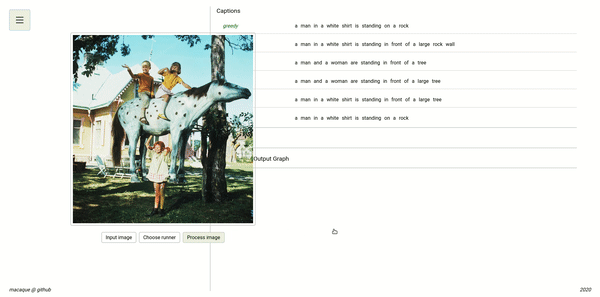

# Macaque



Macaque is a client-server application for analyzing inference resutls of models on the tasks of image captioning and multimodal translation, as well as for creating intuitions about the inner workings of such models through visualization and organized presentation of information.

### Prerequisite software
- Python3
- pip
- npm

### Installation

Create a Python virtual environment and activate it:
```
python3 -m venv macaque-venv
source macauqe-venv/bin/activate
```
You can deactivate it later by running `deactivate` from inside your shell.

Clone the repository and install the dependencies by running:

(Note: You might need root permissions to execute the installation script.)
```
git clone https://github.com/sonineties/macaque-reloaded.git
cd macaque-reloaded
./install.sh
```

### Running

`./macaque.sh`

After that, go to http://127.0.0.1:5000 in your browser to enjoy the application.

### Running options

`./macaque.sh --port <port>` to start running on a specific port.

`./macaque.sh --public` to start the application, listening on all public IPs.

### Development

We use Webpack to bundle JavaScript files into a single source file. 
To apply changes made in the frontend of the application run `./build.sh`.